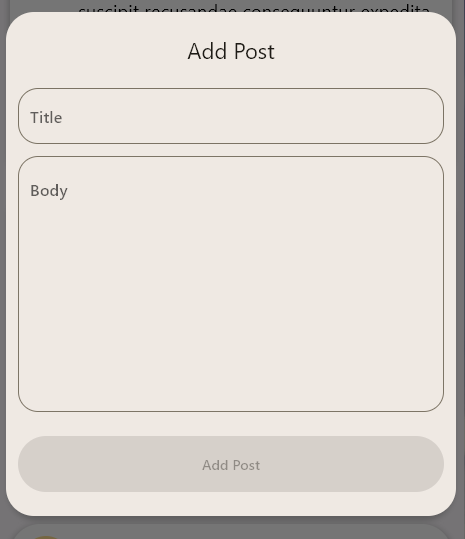

# flutter_gql

Demo App implementing GraphQL in flutter app.

## Getting Started

#### 1. Setup [Flutter](https://flutter.dev/docs/get-started/install)

#### 2. Clone the repo

```bash
git clone https://github.com/manishgupta0/flutter_gql.git
cd flutter_gql/
```

#### 4. Run the following commands to run your app:
```bash
  flutter pub get
  dart run build_runner build -d
  flutter run
```

## Screenshots




